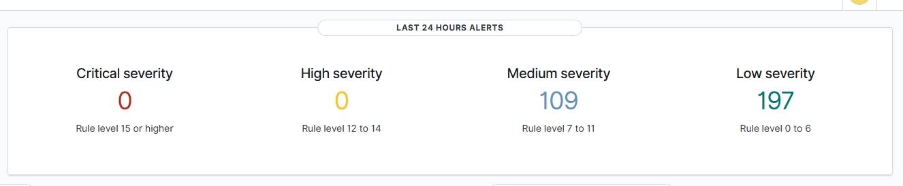
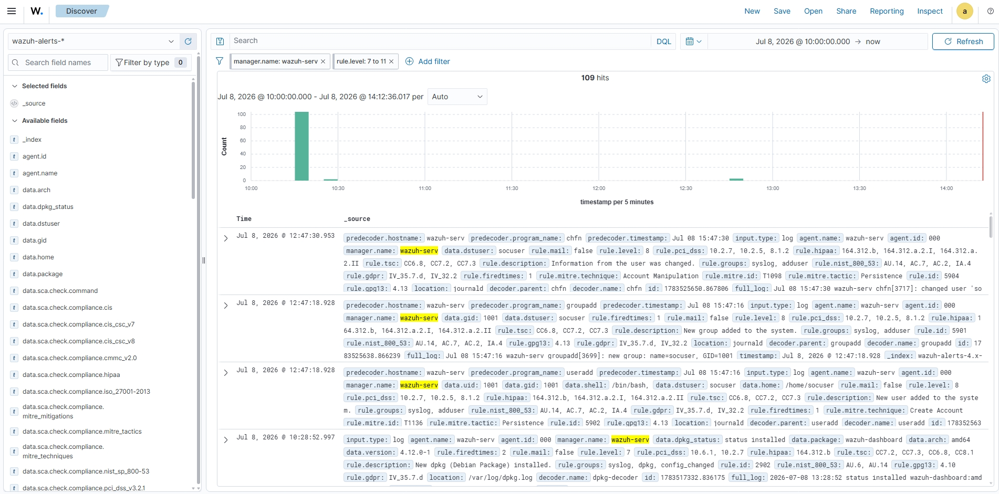

# 🛡️ SOC Wazuh Homelab

A complete Security Operations Center (SOC) Homelab built with **Wazuh** to simulate real-world cyber attacks, monitor Linux systems, investigate security events, and document incident response.

This project demonstrates practical Blue Team skills using enterprise security tools and attack simulations.

---

## 📸 Project Gallery

| Wazuh Dashboard | Security Event Report |
|-----------------|-----------------------|
|  |  |

---

# 🎯 Objectives

- Deploy a complete Wazuh SIEM environment
- Monitor Linux security events
- Detect privilege escalation
- Detect user creation and account modifications
- Implement File Integrity Monitoring (FIM)
- Simulate attacks from Kali Linux
- Investigate alerts using MITRE ATT&CK
- Produce professional incident reports

---

# 🏗️ Architecture

```
                        Windows 11 Host
                     (Browser / Dashboard)
                              │
                        HTTPS :5601
                              │
                              ▼
        ┌────────────────────────────────────┐
        │          Ubuntu Server             │
        │────────────────────────────────────│
        │                                    │
        │  • Wazuh Dashboard                 │
        │  • Wazuh Manager                   │
        │  • Wazuh Indexer                   │
        │  • Local Agent                     │
        │                                    │
        └────────────────────────────────────┘
                     ▲
                     │
             SSH / Nmap / Attacks
                     │
              Kali Linux Attacker
```

---

# 🖥️ Lab Environment

| Component | Description |
|-----------|-------------|
| Host OS | Windows 11 |
| Hypervisor | VirtualBox |
| SIEM | Wazuh 4.12 |
| Server | Ubuntu Server 24.04 LTS |
| Attacker Machine | Kali Linux |
| Network | Host-Only + NAT |

---

# 🛠️ Technologies

- Wazuh SIEM
- Ubuntu Server
- Kali Linux
- Linux
- VirtualBox
- File Integrity Monitoring (FIM)
- Linux Audit
- OpenSearch Dashboard
- MITRE ATT&CK
- Git
- GitHub

---

# 📂 Repository Structure

```
SOC-Wazuh-Homelab/

│
├── README.md
│
├── docs/
│   ├── 01-installation.md
│   ├── 02-user-monitoring.md
│   └── 03-file-integrity-monitoring.md
│
├── screenshots/
│   ├── dashboard.jpeg
│   └── report.jpeg
│
└── reports/
```

---

# ✅ Completed Scenarios

| Status | Scenario |
|---------|----------|
| ✅ | Ubuntu Server Installation |
| ✅ | Wazuh Deployment |
| ✅ | Dashboard Configuration |
| ✅ | Local Agent Registration |
| ✅ | User Creation Detection |
| ✅ | Privilege Escalation Detection |
| 🚧 | File Integrity Monitoring |
| ⏳ | Nmap Detection |
| ⏳ | SSH Brute Force Detection |
| ⏳ | Custom Detection Rules |
| ⏳ | Active Response |
| ⏳ | Windows Agent + Sysmon |

---

# 🔍 Detection Scenarios

## 👤 User Creation Detection

A new Linux user was created using:

```bash
sudo adduser socuser
```

Wazuh successfully detected:

- New user creation
- New group creation
- Account modification
- Related Linux logs
- MITRE ATT&CK mapping

---

## 🔑 Privilege Escalation Detection

Administrative privileges were obtained using:

```bash
sudo su
```

Wazuh generated alerts related to:

- sudo execution
- Privilege escalation
- Authentication logs
- Security event correlation

---

## 📁 File Integrity Monitoring

The Wazuh Syscheck module monitors critical Linux directories for unauthorized changes.

Current monitored directories include:

- /etc
- /usr
- /bin

Upcoming demonstrations will include:

- File creation
- File modification
- File deletion
- Hash verification

---

# 🛡️ MITRE ATT&CK

The project already includes detections mapped to the MITRE ATT&CK framework.

| Technique | Description |
|-----------|-------------|
| T1136 | Create Account |
| T1098 | Account Manipulation |

Future scenarios will cover additional techniques such as brute force, discovery, and persistence.

---

# 📚 Skills Demonstrated

- SIEM Administration
- Security Monitoring
- Blue Team Operations
- Linux Administration
- Log Analysis
- Incident Investigation
- MITRE ATT&CK Mapping
- File Integrity Monitoring
- Security Documentation

---

# 🚀 Roadmap

- [x] Install Ubuntu Server
- [x] Deploy Wazuh
- [x] Configure Dashboard
- [x] Register Local Agent
- [x] Detect User Creation
- [x] Detect Privilege Escalation
- [ ] File Integrity Monitoring
- [ ] Nmap Detection
- [ ] SSH Brute Force Detection
- [ ] Custom Detection Rules
- [ ] Active Response
- [ ] Windows Endpoint Monitoring
- [ ] Sysmon Integration
- [ ] Suricata Integration
- [ ] SOAR Automation

---

# 📖 Documentation

Detailed reports and technical documentation are available in the **docs/** directory.

Each scenario includes:

- Objective
- Environment
- Attack Simulation
- Detection
- Evidence
- MITRE ATT&CK Mapping
- Investigation
- Lessons Learned

---

# 🎓 Learning Goals

This homelab was created to develop practical experience in:

- SOC Operations
- Threat Detection
- Incident Investigation
- Security Monitoring
- Linux Security
- Enterprise SIEM Administration

---

# 👨‍💻 Author

## João Vitor Cardoso

Backend Developer transitioning into Cybersecurity.

Currently building practical Blue Team skills through real-world security labs.

- 💼 Aspiring SOC Analyst
- 🛡️ Blue Team
- ☕ Java Backend Developer

**GitHub**

https://github.com/joaovitorcardoso515-bit

**LinkedIn**

(Add your LinkedIn URL)

---

## ⭐ Support

If you found this project useful, consider giving it a ⭐ on GitHub.